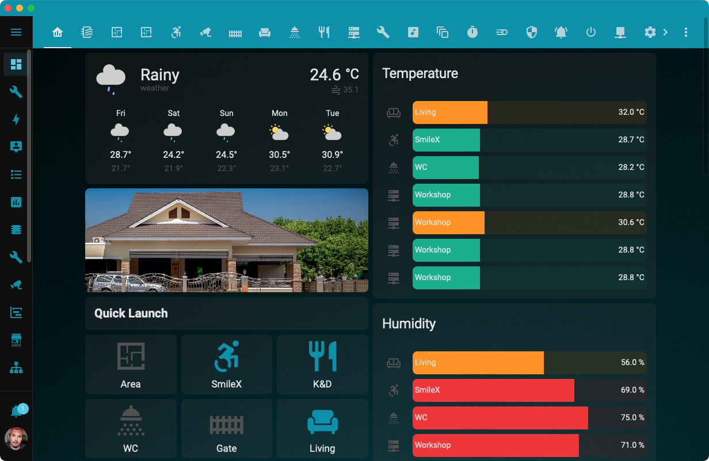

# Home Assistant Kickstart

Repository เตรียม Docker Compose สำหรับเริ่มต้นใช้งาน Home Assistant และบริการที่เกี่ยวข้องได้อย่างรวดเร็ว โดยแต่ละ stack จะถูกจัดเก็บไว้ในโฟลเดอร์ของตัวเองภายใต้ `stack/` เพื่อให้ง่ายต่อการติดตั้ง ดูแลรักษา และขยายระบบ smart home ของคุณ รวมถึงมี boilerplate (แม่แบบตั้งค่าสำเร็จรูปพร้อมใช้) สำหรับการตั้งค่า Home Assistant ที่สามารถนำไปใช้ได้ทันที โดยภายในประกอบด้วยการตั้งค่าพื้นฐานที่จำเป็น พร้อมสำหรับการใช้งาน โดยสามารถนำไปใช้กับ Home Assistant ในรูปแบบการติดตั้งแบบอื่นได้ เช่น การติดตั้งบน  Virtual Machine หรือ Home Assistant OS หรือ Supervised 

## Table of Contents
- [Home Assistant Docker Stacks](stack/README.md)
- [การตั้งค่า Google Assistant เพื่อสั่งงาน Home Assistant ​ฉบับปี 2025](docs/google-home-assistant.md)
- [Home Assistant Boilerplate](stack/homeassistant/ha_config/)

### 📚 Automation Training

- 🛒 [สินค้าและบริการ](http://racksync.com)
- 📖 [เทรนนิ่งคอร์ส](https://facebook.com/racksync)

### 👥 Community

- 🏘️ [Home Automation Thailand](https://www.facebook.com/groups/hathailand)
- 🛍️ [Home Automation Marketplace](https://www.facebook.com/groups/hatmarketplace)
- 💬 [Home Automation Thailand Discord](https://discord.gg/Wc5CwnWkp4) 

## 🏢 [RACKSYNC CO., LTD.](https://racksync.com)

RACKSYNC is a leading expert in Automation and Smart Solutions of all scales. We provide comprehensive consulting services, system implementation, installation, and monitoring by experienced professionals. Additionally, we are a full-service Software as a Service development company.
\
\
📍 RACKSYNC COMPANY LIMITED \
🌏 Suratthani, Thailand 84000 \
📧 Email : devops@racksync.com \
📞 Tel : +66 85 880 8885 

  

## License

ดูรายละเอียดที่ [LICENSE.md](LICENSE.md) ส่วนประกอบแต่ละตัวอยู่ภายใต้ license ของตัวเอง

