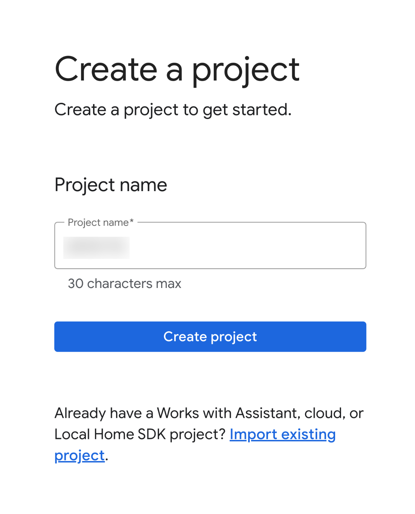
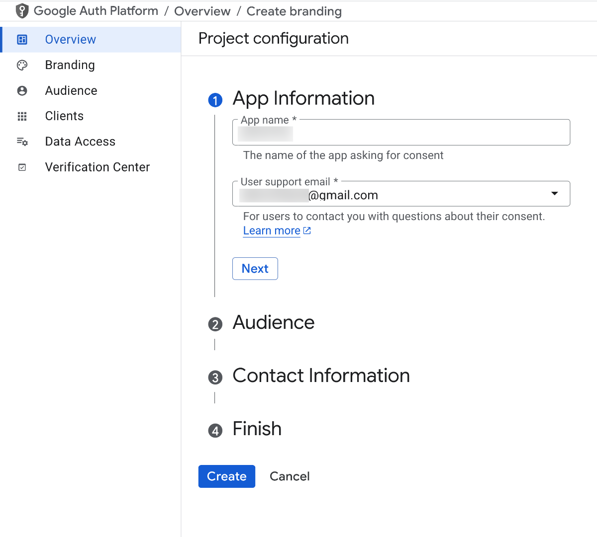
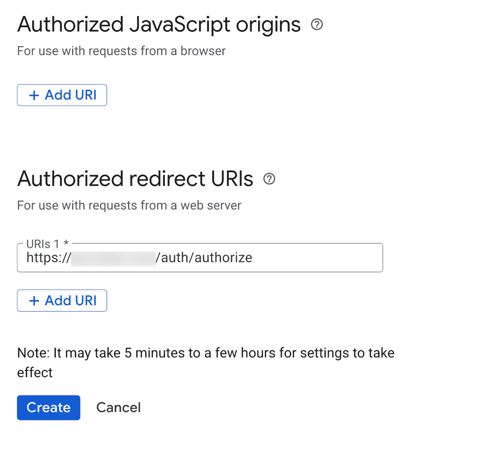
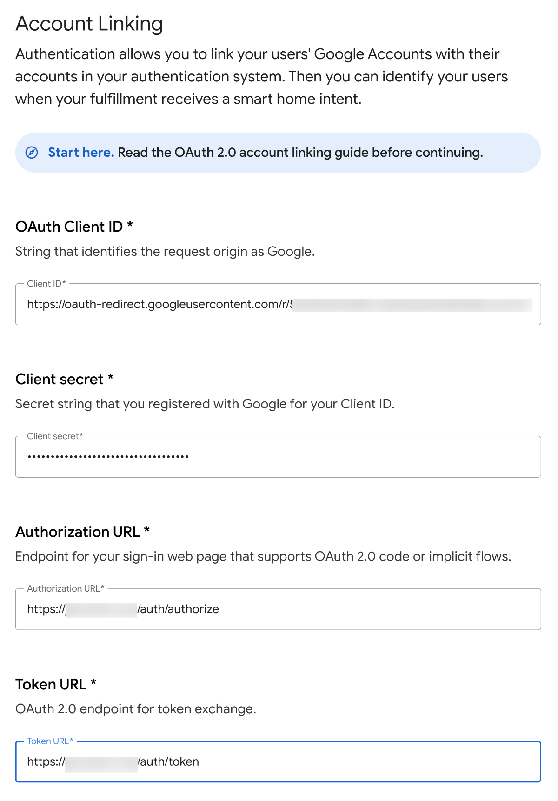

# การตั้งค่า Google Assistant สำหรับ Home Assistant ปี 2025

สรุปขั้นตอนการตั้งค่า Google Assistant integration สำหรับ Home Assistant ด้วยวิธี Manual โดยอ้างอิงจาก [เอกสารอย่างเป็นทางการของ Home Assistant](https://www.home-assistant.io/integrations/google_assistant/) แต่เนื่องจากเอกสารต้นทางยังไม่ได้อัพเดทให้เนื้อหาเป็นปัจจุบัน จึงได้จัดทำคู่มือนี้ขึ้นเพื่อให้เข้าใจง่ายขึ้น ดังนั้นควรตรวจสอบเอกสารล่าสุดจาก Google เสมอ

## ขั้นตอนแบบสังเขป

-   `configuration.yaml` จะต้อง มีการตั้งค่า `http` ให้ถูกต้อง โดยใน `cors_allowed_origins` จะต้องระบุ External URL ของ Home Assistant
-   ต้องมี External URL ที่สามารถเข้าถึงได้จากภายนอก (เช่น  Cloudflare Tunnel)
-   ต้องมี SSL Certificate ที่ถูกต้อง (เช่น Let's Encrypt  หรือ Cloudflare)
-   ต้องมี Google Account ที่สามารถเข้าถึง Google Home Developer Console
-   ต้องมี Google Cloud Project ที่เปิดใช้งาน HomeGraph API
-   ต้องมี Service Account Key ที่ดาวน์โหลดจาก Google Cloud Console
-   ต้องมีไฟล์ JSON ของ Service Account ที่ดาวน์โหลดจาก Google Cloud Console

## บริการที่ใช้ในบทความนี้

-   [Google Cloud Console](https://console.cloud.google.com/)
-   [Google Home Developer Console](https://console.home.google.com/)

## ขั้นตอนหลัก

1.  **ตั้งค่า External Access ให้ Home Assistant**
    *   Google Assistant ต้องการเข้าถึง Home Assistant ของคุณจากภายนอกเครือข่ายผ่าน HTTPS เช่น Cloudflare Tunnel หรือ DuckDNS
    *   ตั้งค่า `http` ใน `configuration.yaml` ของ Home Assistant ให้ถูกต้อง หากใช้ example จาก repo นี้ จะมีตัวอย่างให้แล้ว

2.  **สร้างโปรเจกต์บน Google Home Developer Console**
    *   **คำแนะนำ:** หากมีโปรเจกต์เก่าอยู่ ควรลบออกและยกเลิกการเชื่อมต่อ (unlink) จากแอป Google Home ก่อน
    *   ไปที่: [https://console.home.google.com/projects/create](https://console.home.google.com/projects/create)
    *   **Project name:** ตั้งชื่อโปรเจกต์ (ต้องไม่ซ้ำกับใครในระบบ Google เช่น `hass-ชื่อของคุณ-12345`)
    *   คลิก **Create project**
  
     

3.  **ตั้งค่า Account Linking (OAuth) ใน Google Cloud Console สำหรับนำไปใช้ในข้อถัดไป**
    *   ไปที่ [Google Cloud Console](https://console.cloud.google.com/)
    *   เลือกโปรเจกต์ที่คุณสร้างในขั้นตอนที่ 2
    *   เลื่อนลงมาที่ส่วน **APIs & Services**
    *   เลือก **Credentials**
    *   คลิก **+ CREATE CREDENTIALS** -> **OAuth client ID**
    *   ตั้งค่่า **App Information**:
  
     

    *   **Application type:** เลือก **Web application**
    *   **App Name:** ตั้งชื่อ (เช่น `Google Assistant`)
    *   **User support email:** ใส่อีเมลที่สามารถติดต่อได้ จากนั้นกด **Next**
    *   **Audience** เลือก **External** (ถ้ามี) จากนั้นกด **Next**
    *   **Contact information:** ใส่ข้อมูลการติดต่อ (อีเมล) จากนั้นกด **Next**
    *   **Agree to the terms of service:** ติ๊กถูกที่ช่องนี้ จากนั้นกด **Create**
    *   ไปที่เมนู **Clients** -> **OAuth 2.0 Client IDs**
    *   คลิกที่ **Create client** ระบุ Application type เป็น **Web application** และ ตั้งชื่อ (เช่น `Google Assistant`)
    *   **Authorized redirect URIs:** ใส่ `https://YOUR_HOME_ASSISTANT_URL/auth/authorize` (แทน `YOUR_HOME_ASSISTANT_URL` ด้วย External URL ของคุณ)
        
     

    *   คลิก **Create**
    *   ในหน้าถัดไปจะมีข้อมูล Client ID และ Client Secret ให้นำไปใช้ในขั้นตอนถัดไป

4.  **ตั้งค่า Integration Google Home**
    *   กลับไปที่ [Google Home Console](https://console.home.google.com) ตั้งค่าต่อจากข้อ 2
    *   ในหน้าถัดไป (หรือไปที่โปรเจกต์ที่สร้างแล้ว) เลือก **+ Add integration**
    *   เลือก **Cloud-to-cloud** และคลิก **Next: Develop**
    *   คลิก **Next: Setup**
    *   **Integration name:** ตั้งชื่อที่จะแสดงในแอป Google Home
    *   **Device type:** เลือกประเภทอุปกรณ์ (เช่น Computer)
    *   **App icon:** อัปโหลดไอคอน .png ขนาด 144x144px
    *   **Account Linking:**
       
     

    *   **OAuth Client ID:** ใส่ `https://oauth-redirect.googleusercontent.com/r/YOUR_PROJECT_ID` (แทน `YOUR_PROJECT_ID` ด้วย Project ID ที่ได้จากขั้นตอนที่ 3 (ตัวอย่าง `548725444099-3p3nl6ex69e6lh3kbvbob04vb5lljhbf.apps.googleusercontent.com`)
    *   **Client secret:** ใส่ Client Secret ที่ได้จากขั้นตอนที่ 3
    *   **Authorization URL:** ใส่ `https://YOUR_HOME_ASSISTANT_URL/auth/authorize` (แทน `YOUR_HOME_ASSISTANT_URL` ด้วย External URL ของคุณ)
    *   **Token URL:** ใส่ `https://YOUR_HOME_ASSISTANT_URL/auth/token` (แทน `YOUR_HOME_ASSISTANT_URL` ด้วย External URL ของคุณ)
    *   **Cloud fulfillment URL:** ใส่ `https://YOUR_HOME_ASSISTANT_URL/api/google_assistant` (แทน `YOUR_HOME_ASSISTANT_URL` ด้วย External URL ของคุณ)
    *   คลิก **Next**
    *   **กำหนด Scopes:**
        *   คลิก **+ Add scope** สองครั้ง
        *   เพิ่ม Scope แรก: `email`
        *   เพิ่ม Scope ที่สอง: `name`
        *   คลิก **Next**

5.  **เปิดใช้งาน HomeGraph API**
    *   ไปที่ [Google Cloud Console](https://console.cloud.google.com/)
    *   เลือกโปรเจกต์ที่คุณสร้างในขั้นตอนที่ 2
    *   ไปที่ APIs & Services -> Library
    *   ค้นหา "Google HomeGraph API" และเปิดใช้งาน (Enable)

6.  **สร้าง Service Account Key**
    *   ใน [Google Cloud Console](https://console.cloud.google.com/) ไปที่ APIs & Services -> Credentials
    *   คลิก **+ CREATE CREDENTIALS** -> **Service account**
    *   ตั้งชื่อ Service account (เช่น `google-assistant-hass`) แล้วคลิก **CREATE AND CONTINUE**
    *   **(ไม่บังคับ)** กำหนด Role (ไม่จำเป็นสำหรับขั้นตอนนี้) คลิก **CONTINUE**
    *   **(ไม่บังคับ)** ให้สิทธิ์ผู้ใช้อื่น (ไม่จำเป็น) คลิก **DONE**
    *   ค้นหา Service account ที่เพิ่งสร้างในรายการ คลิกที่อีเมลของ Service account นั้น
    *   ไปที่แท็บ **KEYS**
    *   คลิก **ADD KEY** -> **Create new key**
    *   เลือก **JSON** เป็น Key type แล้วคลิก **CREATE**
    *   ไฟล์ JSON จะถูกดาวน์โหลด ให้นำไปอัพโหลดไว้ที่ `config/google_service_account.json` ไฟล์นี้จะใช้ในการ includes ไว้ใน `configuration.yaml`

7.  **กำหนดค่าใน Home Assistant**
    *   เพิ่ม `google_assistant: !include includes/google_assistant.yaml` ใน `configuration.yaml`
    *   ไฟล์ `google_assistant.yaml` จะมีตัวอย่างการตั้งค่าให้แล้ว สามารถปรับแต่งได้ตามต้องการ:
      ```yaml
      project_id: YOUR_PROJECT_ID # จาก Google Console
      service_account: !include google_service_account.json # หรือใส่ path เต็ม
      report_state: true
      secure_devices_pin: "1234" # ตั้ง PIN ถ้าต้องการ
      expose_by_default: true # เปิดให้อุปกรณ์ทั้งหมดแสดงผล (ไม่แนะนำ)
      exposed_domains:
        - switch
        - light
        - sensor
        - binary_sensor
        - climate
        - cover
        - camera
      ```

8.  **Restart Home Assistant** หลังจากแก้ไข `configuration.yaml` ให้ Restart Home Assistant

## การแก้ไขปัญหาทั่วไป

*   ตรวจสอบ External URL และ SSL Certificate ให้ถูกต้อง
*   ตรวจสอบว่า `google_assistant:` ใน `configuration.yaml` ถูกต้องและไฟล์ Service Account JSON เข้าถึงได้
*   ตรวจสอบ Log ของ Home Assistant และ [Google Cloud Console](https://console.cloud.google.com/) เพื่อหาข้อผิดพลาด
*   ตรวจสอบการตั้งค่า Account Linking ใน [Credentials](https://console.cloud.google.com/apis/credentials) อีกครั้ง

9.  **Google Home Link** เปิด App Google Home เชื่อมต่อ Link with Google แล้วเลือก App ที่ได้ตั้งค่าไว้ กรอก username / password ของ Home Assistant ตามปกติ**

**หมายเหตุ:** ขั้นตอนอาจมีการเปลี่ยนแปลงตามการอัปเดตของ Google และ Home Assistant โปรดอ้างอิงเอกสารทางการล่าสุดเสมอ

## แหล่งข้อมูลเพิ่มเติม
- [Known Issue](https://github.com/home-assistant/core/issues/132515)
- [Google Assistant Integration](https://www.home-assistant.io/integrations/google_assistant/)
- [Google Cloud Console](https://console.cloud.google.com/)
- [Google Home Developer Console](https://console.home.google.com/)
- [Google Assistant API](https://developers.google.com/assistant/sdk)

```
Last updated: 2025-04-20
```